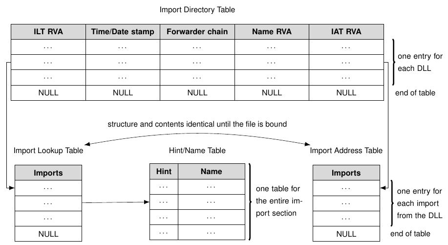
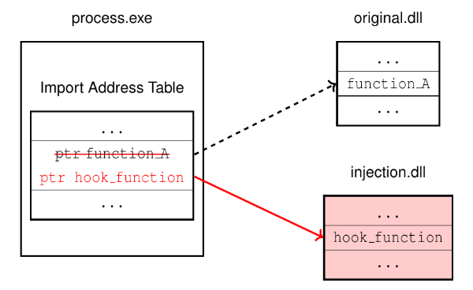
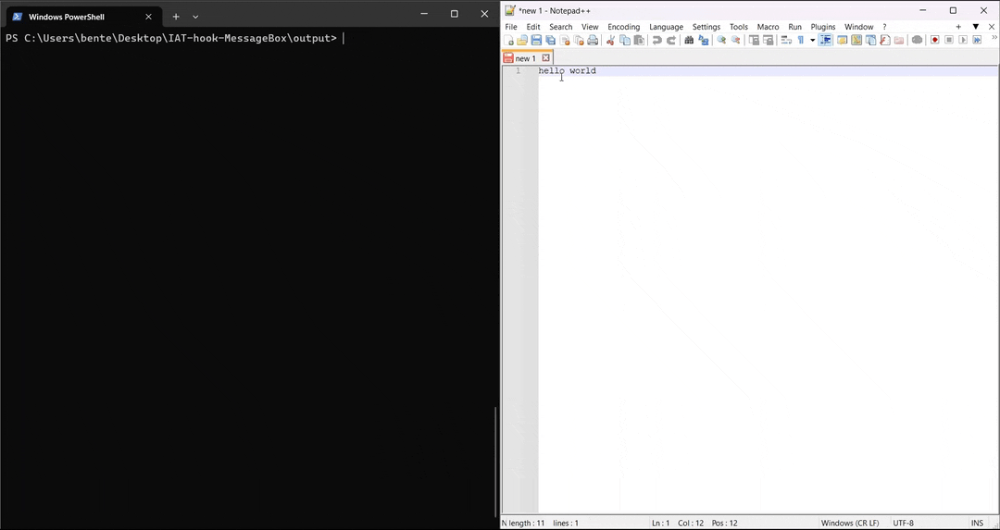

# Import Address Table (IAT) hook

This Visual Studio project contains an example of an IAT hook on the `MessageBoxW` function in the `user32.dll`.

## Background: DLL Linking

When a program is implicitly linked to a DLL, the compiled program will contain symbols that refer to the its Import Directory Table.
The DLL will use an Export Directory Table to export symbols that refer to the implemented functions in the DLL.

When a program and its linked DLL are loaded into memory, the loader will link the imports of the program to the exports of the DLL by filling the Import Address Table with valid memory addresses.

Whenever the program then later needs to use a particular function from a DLL, it will use the Import Directory Table to find the memory address of that function and execute it.

## IAT hook

To install an IAT hook, we will first inject the DLL in this project using a [DLL injector](https://github.com/BenteVE/DLL-Injector).
This DLL contains a hook function and an installation function.

The installation function will first traverse the Import Directory Table to find the location with the memory address of the target function.
The structure of the Import Directory Table is illustrated below.
The complete structure of the PE format is described in the [Microsoft PE format](https://learn.microsoft.com/en-us/windows/win32/debug/pe-format).



After the correct location has been found, it will overwrite the memory address of the real function with the address of the hook function in our injected DLL.



In this particular implementation, we will hook the `MessageBoxW` function in the `user32.dll`.
The hook function will simply call the original function with a modified argument to replace the title.

## Demo

1. Clone the repository:

    ```bash
    git clone https://github.com/BenteVE/IAT-hook-MessageBoxW.git
    ```

2. Build the DLL for the desired architecture (x86 or x64) using Visual Studio.
   The architecture of the DLL should match the architecture of the target program and the used DLL injector.

3. Use a DLL injector to inject the built DLL into the target process.
   The injector used here is available in another [repository](https://github.com/BenteVE/DLL-Injector) with a detailed explanation.

4. Trigger an action that uses a `MessageBox` in the target program to verify that the hook worked.
   For Notepad++, attempting to close an unsaved file does this:

    
